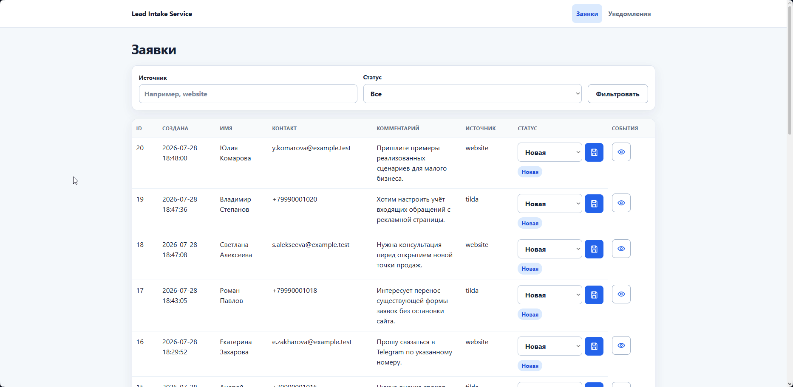

# Lead Intake Service
[](https://github.com/relaystack-lab/lead-intake-service/actions/workflows/ci.yml)

Lead Intake Service принимает заявки с сайтов и из веб-форм, хранит их в SQLite, отправляет уведомления и предоставляет защищённую админку для работы с заявками малого бизнеса.



## О проекте

Сервис объединяет входящие заявки из нескольких источников в единый API, исключает повторную обработку и даёт сотруднику компактный интерфейс для контроля статусов и каналов уведомлений.

- Приём идемпотентен: совпадение `contact` и `comment` в течение пяти минут возвращает уже созданную заявку.
- События жизненного цикла сохраняются в отдельном event log, поэтому действия по заявке можно проверить в админке.
- Секреты Telegram и SMTP хранятся в SQLite в зашифрованном виде с использованием Fernet; интерфейс показывает лишь маску.
- Уведомления запускаются после ответа API в фоновой задаче, а сбой одного канала не влияет на заявку и другие каналы.
- Миграции Alembic применяются при запуске контейнера до старта HTTP-сервера.

## Возможности

- Приём заявок через JSON API и адаптер форм Tilda.
- Поиск и постраничный список заявок с фильтрами по источнику и статусу.
- Уведомления в Telegram и по Email (SSL или STARTTLS).
- Админка с HTTP Basic-авторизацией, сменой статуса через HTMX и просмотром событий.
- Настройка, включение и проверочная отправка каналов уведомлений.

## Стек

| Задача | Технология |
| --- | --- |
| HTTP API и админка | FastAPI, Jinja2, HTMX |
| Хранение и миграции | SQLAlchemy 2.x, SQLite, Alembic |
| Настройки и валидация | Pydantic v2, pydantic-settings |
| Уведомления | httpx, SMTP, cryptography/Fernet |
| Качество | pytest, ruff, GitHub Actions |
| Развёртывание | Docker, Docker Compose |

## Архитектура

```text
src/lead_intake/
├── main.py                    # Фабрика FastAPI-приложения и lifespan
├── config.py                  # Настройки из .env
├── db.py                      # SQLAlchemy engine и сессии
├── models.py                  # Lead, Event, NotificationChannel
├── security.py                # API-key, Basic Auth и Fernet
├── api/                       # JSON API и адаптер Tilda
├── services/                  # Дедупликация и доставка уведомлений
├── admin/views.py             # HTML-админка
├── static/admin.css            # Общие адаптивные стили админки
└── templates/                 # Jinja2-шаблоны и HTMX-фрагменты
alembic/                       # Версионируемые миграции БД
tests/                         # Unit- и интеграционные тесты
examples/                      # curl и HTTP-примеры запросов
```

Роутеры принимают и отображают HTTP-данные, а дедупликация, изменение статусов и отправка уведомлений находятся в сервисном слое. Модель хранения не зависит от представлений админки.

## Быстрый старт

### Docker Compose

Для Windows нужен Docker Desktop, для Linux — Docker Engine с Docker Compose plugin.

1. Создайте локальный файл окружения:

   Windows PowerShell:

   ```powershell
   Copy-Item .env.example .env
   ```

   Linux:

   ```sh
   cp .env.example .env
   ```

2. Сгенерируйте ключи для `API_KEY` и `SECRETS_KEY`:

   ```sh
   docker compose build app
   docker compose run --rm --no-deps app lead-intake generate-api-key
   docker compose run --rm --no-deps app lead-intake generate-fernet-key
   ```

   Скопируйте первый результат в `API_KEY`, второй — в `SECRETS_KEY` файла `.env`. Затем задайте собственные `ADMIN_USERNAME` и `ADMIN_PASSWORD`.

3. Запустите сервис:

   ```sh
   docker compose up -d --build
   ```

4. Проверьте готовность:

   Windows PowerShell:

   ```powershell
   Invoke-RestMethod http://localhost:8000/health
   ```

   Linux:

   ```sh
   curl --fail-with-body http://localhost:8000/health
   ```

   Ожидаемый ответ: `status : ok`. API-документация доступна на `http://localhost:8000/docs`, админка — на `http://localhost:8000/admin/leads`.

SQLite хранится в именованном Docker volume `lead-intake_lead_intake_data`; пересоздание контейнера не удаляет заявки.

Приложение также пишет JSONL-логи на хост в `output/logs/`: активный файл `application.jsonl` ежедневно архивируется в `.gz`. Количество ежедневных архивов задаётся `LOG_RETENTION_DAYS` и по умолчанию равно 30. Временные метки в логах записываются в UTC (`+00:00`). При неуспешной доставке уведомления запись `notification_delivery_failed` содержит `lead_id`, канал, `attempt_id`, безопасный код причины и статус провайдера, если он доступен. Для Telegram причины уточняют отсутствие чата, блокировку бота, деактивацию пользователя, перенос группы и отсутствие прав на отправку. Токены, пароли, контакты и тексты ответов внешних сервисов в эту запись не попадают.

Просмотреть состояние контейнеров и последние строки системного вывода:

```sh
docker compose ps
docker compose logs --tail=100 app
```

### Локальный запуск

Windows PowerShell:

```powershell
py -3.12 -m venv .venv
.\.venv\Scripts\Activate.ps1
python -m pip install -e ".[dev]"
Copy-Item .env.example .env
lead-intake generate-api-key
lead-intake generate-fernet-key
alembic upgrade head
uvicorn lead_intake.main:app --host 127.0.0.1 --port 8000 --no-access-log
```

Linux:

```sh
python3.12 -m venv .venv
. .venv/bin/activate
python -m pip install -e ".[dev]"
cp .env.example .env
lead-intake generate-api-key
lead-intake generate-fernet-key
alembic upgrade head
uvicorn lead_intake.main:app --host 127.0.0.1 --port 8000 --no-access-log
```

Скопируйте первый выведенный ключ в `API_KEY`, второй — в `SECRETS_KEY` файла `.env`, затем заполните учётные данные админки. Для генерации ключей без активации окружения есть скрипты `examples/generate-api-key.ps1`, `examples/generate-fernet-key.ps1`, `examples/generate-api-key.sh` и `examples/generate-fernet-key.sh`. Linux-варианты запускаются через `sh examples/<имя-скрипта>.sh`.

Сгенерируйте ключ один раз до настройки каналов и сохраните его в защищённом хранилище. Замена или потеря ключа делает ранее сохранённые Telegram- и SMTP-секреты нечитаемыми. Uvicorn access log отключён, чтобы query-параметр `api_key` адаптера Tilda не попадал в системный вывод контейнера; безопасные JSONL-логи приложения продолжают записываться в `output/logs/`.

## Документация API

`/docs` — интерактивная документация внешнего API, сформированная из OpenAPI. В ней доступны операции для интеграций: проверка состояния, приём и получение заявок, а также адаптер Tilda.

Для операций API заявок нажмите `Authorize` и укажите `X-API-Key`. Для Tilda в том же окне укажите ключ схемы `TildaApiKey`: Swagger передаст его как query-параметр `api_key`. Для Tilda документация предлагает JSON и `application/x-www-form-urlencoded` с полями `Name`, `Phone`, `Email`, `Comments`.

## Пример работы

1. Задайте ключ и выполните пример запроса:

   Windows PowerShell:

   ```powershell
   $env:API_KEY = "<значение API_KEY из .env>"
   .\examples\create-lead.ps1
   ```

   Linux:

   ```sh
   API_KEY="<значение API_KEY из .env>" sh examples/create-lead.sh
   ```

   Альтернатива для HTTP-клиента — запрос из `examples/api.http`.

2. Сервис создаст заявку, запишет событие `lead_received` и запустит уведомления по включённым каналам.
3. Откройте `/admin/leads` с учётными данными из `.env`, измените статус заявки и перейдите к её журналу событий.

Для каждого канала уведомлений укажите рабочие и отдельные проверочные получатели. Сначала выполните проверочную отправку: она использует только проверочный список, сохраняет успешно проверенную конфигурацию и разблокирует включение канала. Изменение параметров подключения Telegram или SMTP потребует повторной проверки.

## Тестирование

```powershell
ruff check .
ruff format --check .
pytest
```

Проверки покрывают здоровье приложения, миграции, модели, Fernet-шифрование, API-валидацию и дедупликацию, Tilda, изоляцию сбоев уведомлений и админку. HTTPX и SMTP в тестах подменяются моками.

## Когда продукт уместен

Сервис подходит небольшим командам, которым нужен единый контролируемый вход для заявок сайта и форм, быстрые уведомления и простой журнал обработки без внешней CRM.

## Резервное копирование и обновление

Перед обновлением создайте резервную копию SQLite:

Windows PowerShell:

```powershell
New-Item -ItemType Directory -Force backups
docker compose stop app
$containerId = docker compose ps --all -q app
docker cp "${containerId}:/data/lead_intake.db" ".\backups\lead_intake.db"
docker compose start app
```

Linux:

```sh
mkdir -p backups
docker compose stop app
container_id="$(docker compose ps --all -q app)"
docker cp "${container_id}:/data/lead_intake.db" "./backups/lead_intake.db"
docker compose start app
```

Для восстановления остановите сервис, скопируйте файл обратно и запустите его:

Windows PowerShell:

```powershell
docker compose stop app
$containerId = docker compose ps --all -q app
docker cp ".\backups\lead_intake.db" "${containerId}:/data/lead_intake.db"
docker compose start app
```

Linux:

```sh
docker compose stop app
container_id="$(docker compose ps --all -q app)"
docker cp "./backups/lead_intake.db" "${container_id}:/data/lead_intake.db"
docker compose start app
```

После обновления исходного кода выполните `docker compose up -d --build`. Контейнер автоматически применит все новые миграции Alembic перед запуском приложения.

## Пути развития

- Адаптеры заявок для дополнительных каналов
- Доставка заявок в CRM (Bitrix24, amoCRM и др.)
- Переход на PostgreSQL для роста нагрузки и объёма данных.
- Подключение внешнего секрет-менеджера вместо ключа в окружении.
- Оповещения администратора о системных ошибках и недоступности каналов.

## Лицензия

Проект распространяется по лицензии [MIT](LICENSE).

## Автор

RelayStack Lab
